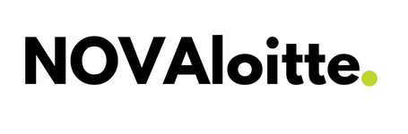
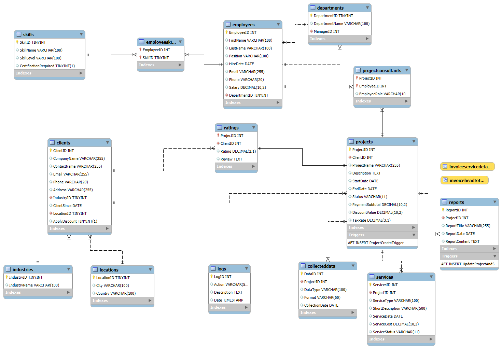

# 🗄️ NOVAloitte: A Relational Database & Reporting System 🚀

<p align="center">
  
</p>

<p align="center">
    <!-- Project Links -->
    <a href="https://github.com/Silvestre17/StoringData.SQL_MasterProject"></a>
</p>

## 📝 Description

**NOVAloitte** is a comprehensive database project designed for a fictitious data science and technology consulting firm. This project demonstrates the end-to-end process of building a robust, normalized relational database from the ground up. It covers everything from initial **Entity-Relationship Diagram (ERD)** design and **SQL implementation** to advanced features like **triggers**, **views for reporting**, and automated **PDF invoice generation** using a Python script.

## ✨ Objective

The primary objective of this project was to design and implement a fully functional database system capable of:
*   Managing clients, projects, employees, and services in a structured, relational model.
*   Ensuring data integrity and consistency through normalization (up to 3NF) and constraints.
*   Automating data logging and status updates using SQL Triggers.
*   Answering key business questions through complex SQL queries.
*   Generating professional, data-driven invoices automatically from the database.

## 🎓 Project Context

This project was developed for the **Storing and Retrieving Data (SRD)** course in the **[Master's in Data Science and Advanced Analytics](https://www.novaims.unl.pt/en/education/programs/postgraduate-programs-and-master-degree-programs/master-degree-program-in-data-science-and-advanced-analytics-with-a-specialization-in-data-science/)** program at **NOVA IMS**. The work was completed during the **1st Semester, 2nd Trimester** of the **2024/2025** academic year.

## 🛠️ Technologies Used

The project combines a powerful relational database backend with a Python scripting layer for automated reporting.

<p align="center">
    <a href="https://www.mysql.com/">
        
    </a>
    <a href="https://www.python.org/">
        
    </a>
    <a href="https://reportlab.com/">
        
    </a>
</p>

---

## ⚙️ Project Structure & Key Features

#### 1. Database Design & Implementation (MySQL)
The foundation of the project is a well-structured relational database built in MySQL.
*   **ERD & Normalization:** A detailed Entity-Relationship Diagram was designed to model all business entities, ensuring data is normalized to the Third Normal Form (3NF).
*   **Data Integrity:** Implemented a wide range of constraints, including `PRIMARY KEY`, `FOREIGN KEY`, `CHECK`, and `DEFAULT` to maintain data accuracy and consistency.
*   **Data Types Optimization:** Used optimized data types like `TINYINT` for fields with a small range of values to improve performance.

#### 2. Advanced SQL Features: Triggers
Two triggers were created to automate key business logic at the database level:
*   **`ProjectCreateTrigger`:** An `AFTER INSERT` trigger on the `Projects` table that automatically calculates the total net payment (including taxes and discounts) and logs a detailed description of the new project into a `Logs` table.
*   **`UpdateProjectAndServicesStatusAfterReport`:** An `AFTER INSERT` trigger on the `Reports` table that automatically updates the status of the corresponding project and all its associated services to 'Completed'.

#### 3. Data Abstraction for Reporting: SQL Views
To simplify invoice generation and decouple the reporting logic from the base table structure, two SQL `VIEW`s were created:
*   **`InvoiceHeadTotals`:** Gathers all client and project-level information needed for the invoice header and summary totals.
*   **`InvoiceServiceDetails`:** Aggregates all services related to a specific project to populate the line items of an invoice.

#### 4. Automated Invoice Generation (Python & ReportLab)
A Python script was developed to automatically generate professional PDF invoices from the database.
*   **Database Connectivity:** Uses the `mysql-connector-python` library to connect to the MySQL database and query the views.
*   **PDF Generation:** Leverages the **ReportLab** library to dynamically create a structured, well-formatted invoice document, including the company logo, tables, and calculated totals.

## 🔗 Database Schema (ERD)

The Entity-Relationship Diagram below illustrates the structure and relationships between the 13 tables in the `NOVAloitteDB`.

<p align="center">
    
</p>

## ❓ Business Intelligence Queries

The system was designed to answer key business questions for management. The following 5 queries were developed to provide critical insights:

1.  What is the total number of projects per client?
2.  What is the total revenue generated by each industry?
3.  What is the average project rating for each consultant role?
4.  What is the total amount invoiced in the year 2024?
5.  What is the number of "In Progress" projects for each department?

## 🚀 How to Run the Project

This project requires both a MySQL database and a Python environment.

#### Step 1: Database Setup
1.  **Start MySQL:** Ensure you have a running MySQL server instance.
2.  **Run the SQL Script:** Execute the entire `NOVAloitteDB_Script.sql` file in a MySQL client (like MySQL Workbench or the command line). This single script will:
    *   Create the `NOVAloitteDB` database.
    *   Create all 13 tables with their constraints.
    *   `INSERT` all the initial data.
    *   Create the `Triggers` and `Views`.
    ```bash
    mysql -u your_username -p < NOVAloitteDB_Script.sql
    ```

#### Step 2: Python Invoice Generator
1.  **Create a Virtual Environment:** It is highly recommended to use a virtual environment.
    ```bash
    python -m venv venv
    source venv/bin/activate  # On macOS/Linux
    .\venv\Scripts\activate  # On Windows
    ```
2.  **Install Dependencies:**
    ```bash
    pip install mysql-connector-python reportlab
    ```
3.  **Run the Script:** Execute the Python script from your terminal. It will prompt you to enter a project ID to generate an invoice.
    ```bash
    python generate_invoice.py
    ```
    The generated PDF will be saved in the `Invoices/` directory.

## 🎥 Note on Project Video
A video demonstration of the project, covering all the steps outlined in the assignment brief, was created and submitted for evaluation. For privacy reasons concerning the project group members, this video is not publicly available in this repository.

## 👥 Team Members (Group 37)

*   **André Silvestre** (20240502)
*   **Filipa Pereira** (20240509)
*   **Umeima Mahomed** (20240543)